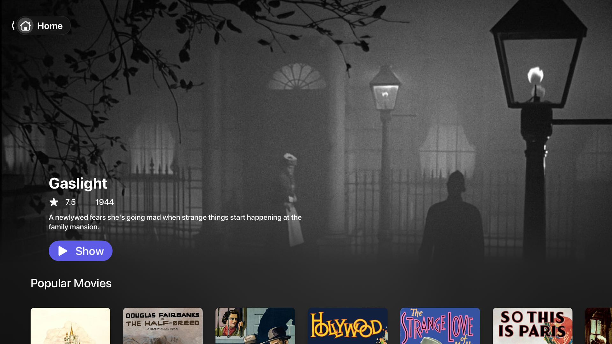
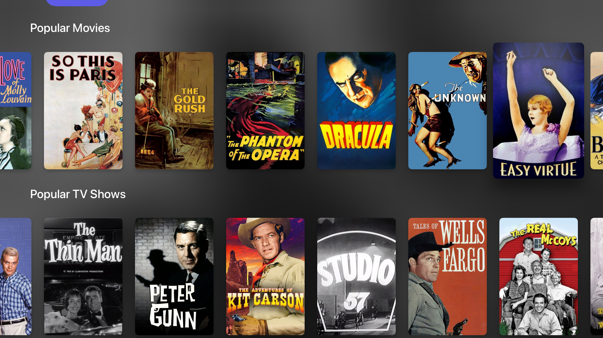
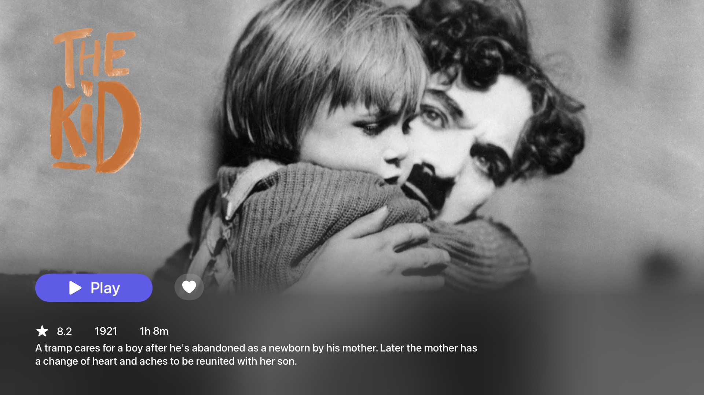
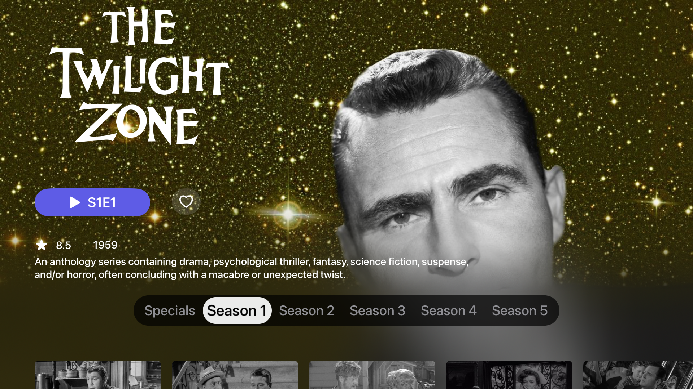
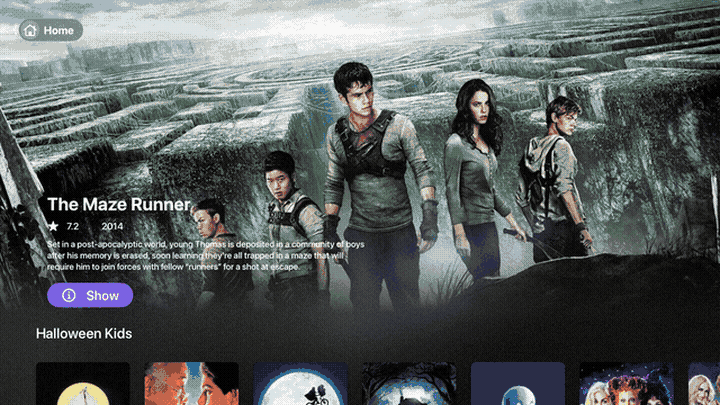

# Velo - Your Media Hub

Velo is a native tvOS application designed to be your ultimate media hub. Discover, track, and enjoy movies and TV shows seamlessly on your Apple TV. For more details, visit our [website](https://devvvelo.github.io).

## Features

*   **tvOS First:** Built from the ground up for a native tvOS experience, ensuring optimal performance and user interface.
*   **Smart Playback:** Intelligently tracks your playback progress across all your content, so you never lose your spot.
*   **Content Discovery:** Integrates with TMDB for rich metadata and offers Streamio add-on support for expanded catalog and streaming options.
*   **Custom Shelves:** Organize your media with customizable shelves for movies, TV shows, networks, and anime.
*   **Intuitive tvOS Experience:** Enjoy an optimized interface and smooth playback with a built-in internal player.
*   **Personal Library:** Easily manage your watch list and favorite content.

## Screenshots

| Home Screen | Media Shelves | Movie Detail | Series Detail |
|---|---|---|---|
|  |  |  |  |

## How-to

| Add a Stremio Addon | Build a Custom Media Shelf | Edit a Media Shelf |
|---|---|---|
|  |  |  |
| Add a Stremio Addon to expand your content library. | Build your own custom media shelves to organize content. | Edit existing media shelves to fine-tune your organization. |

## Tips for Using Velo

*   **Context Menu:** Long-press on any media card to reveal alternative options. For example, you can delete recently watched items or access alternative streams for playback.
*   **Remote App for URLs:** For easy input of long add-on URLs, use your iPhone's Remote app to copy and paste directly into Velo.
*   **Customizable Home Screen:** Tailor your home screen by enabling or disabling media shelves directly from the app's settings.
*   **Personal TMDB API Key:** To unlock full functionality and content, obtain a free personal TMDB API key and add it within Velo's settings.

## Getting Started

(Further instructions on how to build, install, or acquire Velo would go here if available.)
